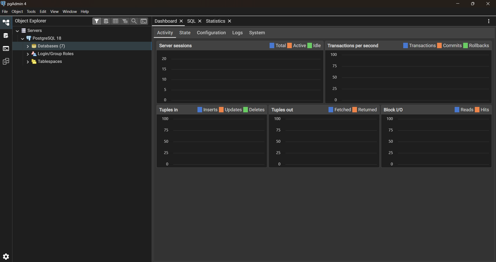
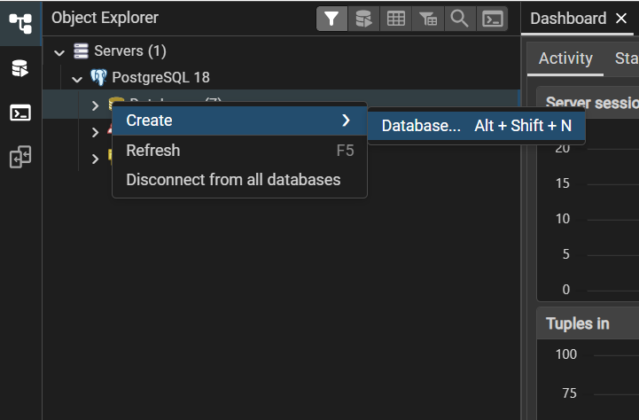
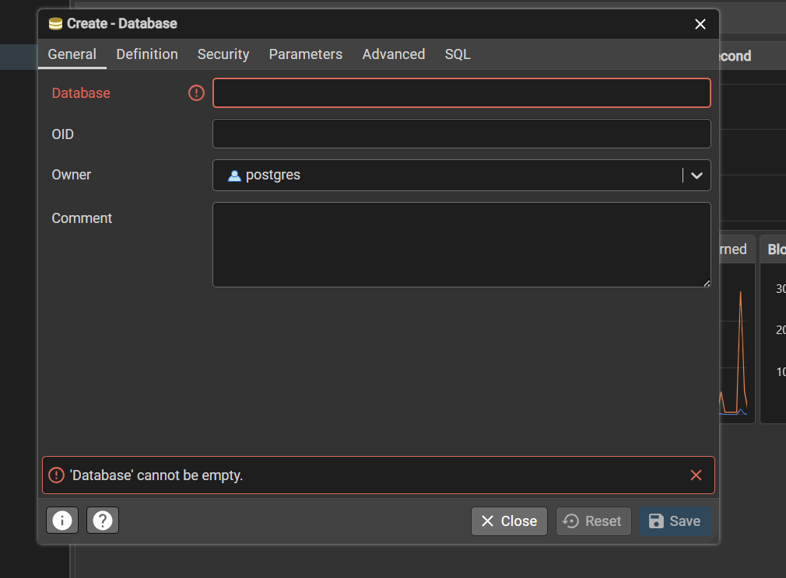

# LiterAlura

A LiterAlura é um desafio que faz parte do programa ONE | TECH FOUNDADTION

O desafio é você buscar livros usando a api Gutendex e depois salvar no banco de dados.
O próximo passo é você implementar várias funcionalidades, como pegar listar cadastrados no banco, listar autores, listar os top livros com mais downloads etc.

Para começar faça um cópia desse repositório, seja baixando eu clonando.

Na pasta raiz do projeto crie um arquivo chamado ``.env``
```
literalura/
├── .idea
├── .mvn
├── .src/
├── ... 
├── .env
```

Copie isso para a arquivo ``.env``

```
DB_HOST= // Digite o endereço do seu banco de dados, localhost, se for local
DB_NAME_LOCAL= // Nome do seu banco de dados local
DB_USER= // Nome de usuário do seu banco de dados
DB_PASSWORD= // Senha do seu banco de dados
```

Para o projeto funcionar você precisar ter o Postgresql instalado no seu computador. [Baixe aqui o Postgresql](https://www.enterprisedb.com/downloads/postgres-postgresql-downloads)

Depois de baixar e instalar pesquise na barra de pesquisa "PgAdmin4". Clique para abrir.

Será preciso você colocar a senha que você definiu durante a instalação.

Essa será a tela incial do PgAdmin4



Clique com o botão direito na opção "Databases", passe o mouse sobre "Create" e depois clique em "Database". Como na imagem abaixo.



No campo "Database" você coloca o nome do seu banco, e depois clique em save.



Depois de fazer isso, se certifique do nome ser igual aquele que você definiu no arquivo ``.env``.

Pronto! Agora basta rodar a aplicação.


### Tecnologias usadas
**SPRING FRAMEWORK**, **POSTGRESQL** e **JAVA**.